# 너LANG나

## **외국인과의 언어 및 친목 교류 커뮤니티**

## 배포

[너LANG나 배포 URL](https://i7a603.p.ssafy.io)

## 👨‍👩‍👧 Notion

---

`A603 팀 노션 링크`

[2학기 공통 프로젝트-YouLangMe](https://www.notion.so/2-YouLangMe-ad727a9ac92c4927a246106890bc05da)

모두가 봐야할 공지, 참고 할 링크 등을 모아 관리했습니다. 그리고 항상 모든 회의 및 피드백은 기록으로 남겨두어서 잘 반영할 수 있도록 하였습니다. 컨벤션 규칙, 요구사항 정의서, API 문서 등도 노션에 기록하여 모두가 항시 확인할 수 있도록 관리했습니다.


## ✨Overview

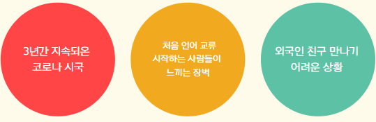

2020년도부터 시작된 코로나 바이러스로 인한 펜데믹 시대에 많은 사람들이 지치고 힘든 시간을 보내고 있습니다. 지금은 물론 조금씩 상황이 나아지고 있는 추세이지만 이전에 코로나가 심했던 시국부터 시작을 해서 많은 사람들이 혼자 있게 되는 시간이 많아지고 집에만 있는 시간이 많아졌습니다.
대학교를 다니며 많은 사람과 교류하고 다양한 친구들을 만날 수 있는 만남의 장소와 소통의 영역이 많이 좁아지고 부족해졌습니다.

이것에 더해 코로나로 인해 막혀 버린 해외 길로 인해 자유롭게 여행 및 외국인과의 교류를 할 수 없게 되었습니다. 제 주변에 교환 학생을 꿈꾸거나 어학 연수를 꿈꿨던 학생들이 많이 아쉬워하는 모습을 보게 되었고 저희는 이런 상황을 타파하기 위해 언어 교류를 통해 친구도 사귀고 언어 소통도 할 수 있는 너랑 나, 너와 내가 소통할 수 있는 즉 YouLangMe 라는 서비스를 개발하게 되었습니다.

## 🖼서비스 화면

### 회원가입

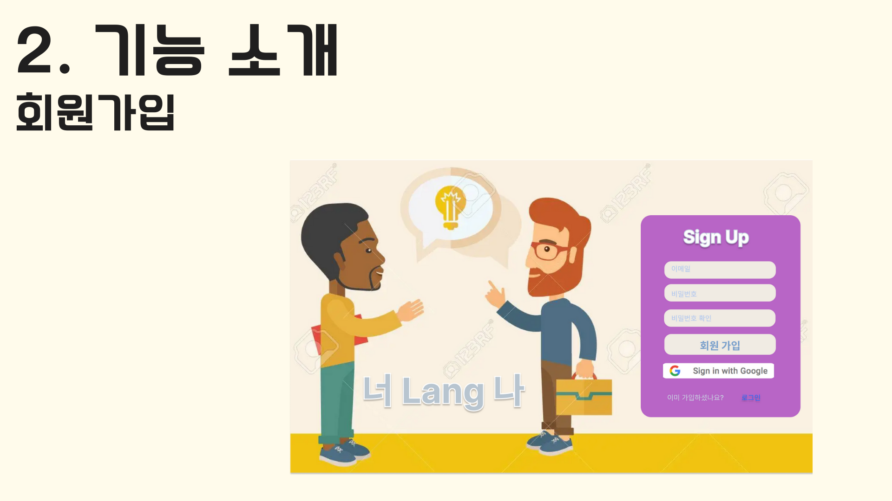

### 로그인

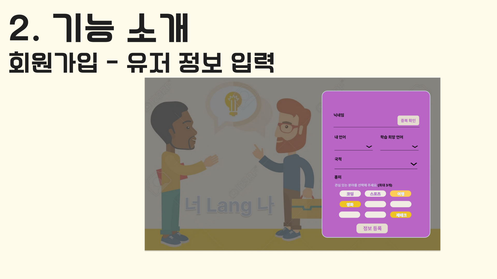

메인 페이지

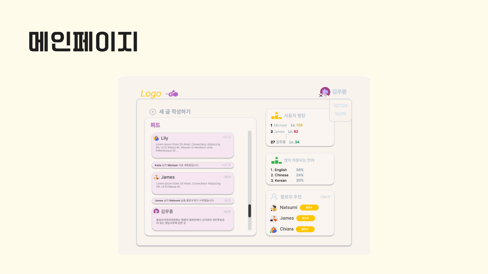

### 소셜 - 프로필 페이지

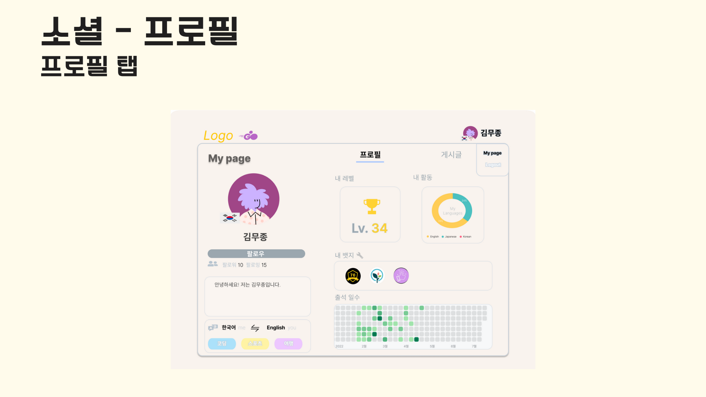

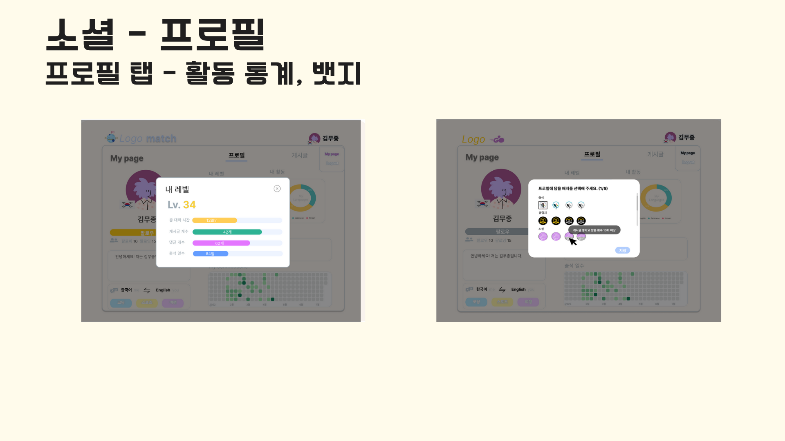

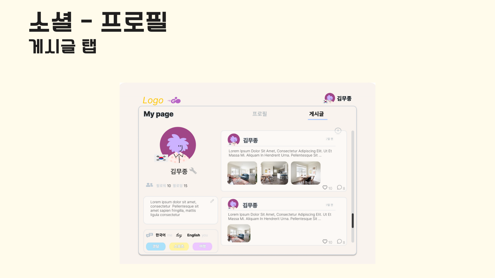

### 소셜 - 게시글

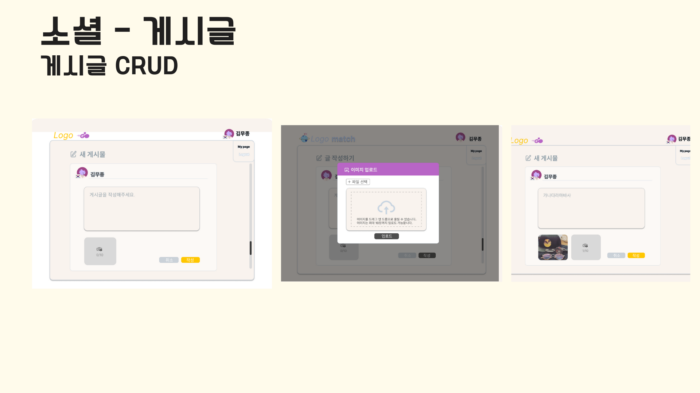

### 매칭 페이지

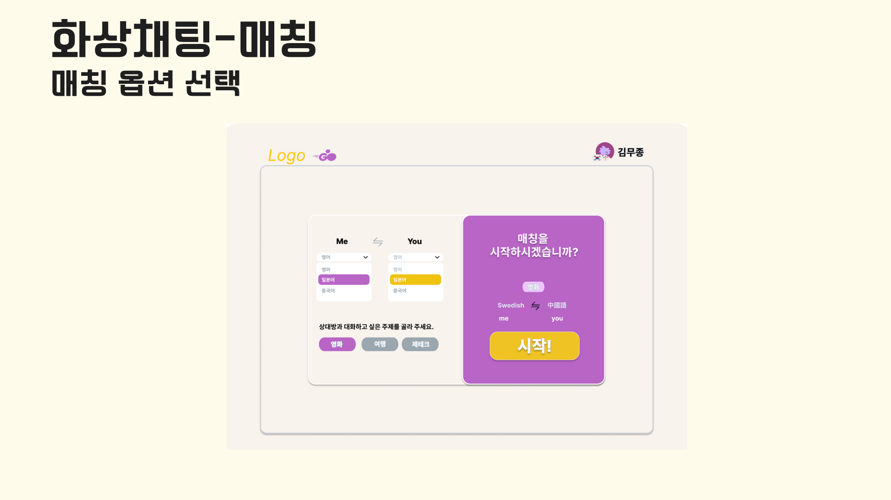

### 영상 채팅 페이지

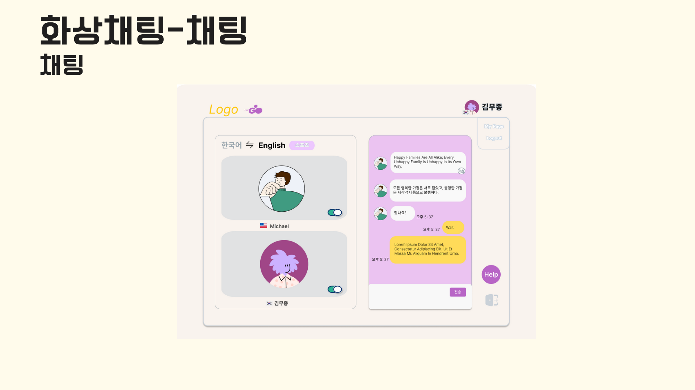

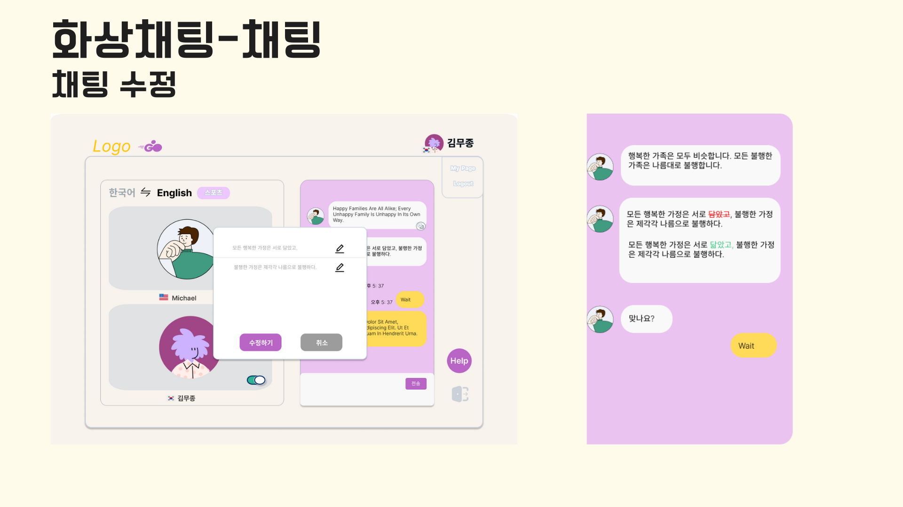

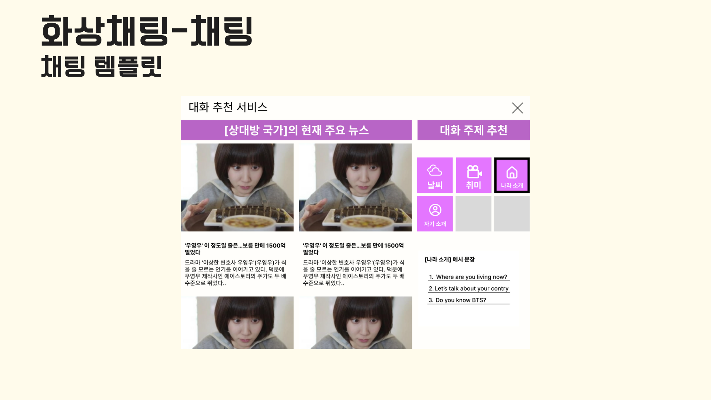


## ✨ 주요 기능

---

- 서비스 설명 : 외국인과의 쉽게 만날 수 있는 언어 교류 서비스
- 주요 기능 :
  - webRTC를 통한 실시간 화상 1:1 매칭 채팅
  - 활동 log를 통한 사용자 레벨 시스템 도입 및 다양한 배지 부여
  - 팔로우와 게시글, 댓글 작성을 통한 소셜 기능 제공

## 🖥️ 개발 환경

---

🖱**Backend**

- IntelliJ
- spring boot 2.4.5
- spring-boot-jpa
- Spring Security
- Java 8
- AWS EC2
- mysql
- redis
- django

🖱**Frontend**

- Visual Studio Code
- React.js 17.0.2
- SCSS
- Material-UI
- redux-toolkit 1.8.3
- redux 4.1.0

🖱**Web RTC**

- openvidu 2.19.0

🖱**CI/CD**

- aws ec2
- docker(예정)
- nginx

## 💫 서비스 아키텍처

---


## 💭요구사항 정의서

[공통PJT A603 PRD](https://docs.google.com/spreadsheets/d/1mbaXdqLfJamObidqxuU7AzgRji3CQML2373_ErKILRE/edit#gid=0)

## ✨수동 배포와 SSL 인증서 적용

---

현재 수동 배포를 통해 `[i7a603.p.ssafy.io](http://i7a603.p.ssafy.io)` 도메인 에 백엔드, 프론트엔드, 오픈비두를 모두 연결했습니다. 아직 매칭과 관련된 장고 서버와의 연결이 완전하지 않아, 차후에 이를 해결할 예정입니다.
또한 프론트엔드인 React.js는 향후 Nginx와 함께 docker image로 빌드하여 배포할 예정이며, 백엔드 및 redis, openvidu 또한 docker container로 배포할 예정입니다. 그리고 Nginx와 letsencrypt를 이용하여 ssl 인증서를 적용했으며, 프론트엔드는 port 443(https)로 분기 했으며, 백엔드는 /api 경로로 프록시를 설정했습니다.

## ✨기술 특이점

---

- **1대 1 매칭**

  현재 사용자가 구사 가능한 언어와 배우고자 하는 언어를 선택해서 매칭을 시작하면 다른 사용자들 중 구사 가능한 언어와 배우고자 하는 언어가 교차되어 맞는 사람을 찾아서 상대방의 user id와 Openvidu 방 연결을 위한 session id를 생성해서 두 사용자에게 응답을 보내줍니다. 현재 매칭 로직은 원하는 언어가 서로 충족된 상태에서 관심사의 유사도를 계산해서 일정 기준치를 넘는 사람을 매칭 하도록 하고 있습니다. 향후 사용자 로그를 기반으로 매칭을 개선할 예정입니다.

- **`WebRTC` (`Openvidu`)**

현재는 Openvidu에서 제공한 기능 만으로 배포되어 있습니다. 저희 조는 content based filtering를 통한 언어 교류를 위한 상대방을 연결해주는 시스템을 구현할 예정이므로, 향후 Openvidu 코드를 수정할 필요가 있습니다. 스프링 서버로부터 세션id 정보와 언어 교류를 같이 할 사용자 정보를 받아오는 한편, 사용자의 국적에 해당하는 국기를 매핑할 예정입니다..

사용자에게 더 수월한 언어 교류를 하기 위해서 뉴스 API를 통해 사용자의 국적에 맞는 대화 주제를 제공하는 한편, 채팅 화면에서 구글 번역 API를 통해 상대방의 채팅을 수정하고 번역할 수 있도록 하여 위 어플리케이션을 개선해나갈 예정입니다.

- **`Redis`**

User 랭킹과 Language 랭킹 같은 정보들은 자정마다 업데이트 되는 정보여서 단순한 구조의 정보이고, 반복적으로 동일하게 제공되고, 최신화가 실시간으로 필요하지 않은 정보였습니다. 이러한 데이터의 특성으로 캐싱을 적용하기에 적절하다고 생각을 했고, Redis에 랭킹 정보를 저장하여 DB를 거치지 않고 정보를 가져와 트래픽이 많아질 때 백엔드 부하를 줄이고, 정보 조회 속도를 높였습니다.

- **`redux-toolkit`, `redux-persist`**

프론트엔드 구현 시에는 React와 redux-toolkit을 이용하여 상태 관리를 하였습니다. 또한 redux-toolkit만 사용해서는 새로고침 시에 state 유지가 되지 않으므로, redux-persist를 사용했습니다.

- **배포**

현재는 도커를 사용하지 않고, 수동 배포를 구현하였습니다. 향후 백엔드를 도커 컨테이너로, 프론트로 Nginx와 함께 도커 컨테이너로 배포할 예정입니다.

## 👨‍👩‍👧 협업 툴

---

- `Git`
- `Jira`
- `Notion`
- `Mattermost`
- `Webex`

---

---

## ✨코드 컨벤션

---

```
- 의미 없는 변수명 X, 최대한 직관적으로 변수명 지어주세요.
	⇒ 유지보수 힘들고, 알아보기 힘드니 반드시 지양해주세요.

- 메서드 이름은 소문자로 시작하고, 동사로 지으면 좋다! ex) getName()

- 변수명, 메서드 이름은 camelCase로 지어주세요

- 클래스 이름은 대문자로 시작합니다

- 리액트 컴포넌트명은 PascalCase로 지어주세요.
```

해당 [Code Convention 가이드](https://udacity.github.io/git-styleguide/), [네이밍 규칙](https://tyboss.tistory.com/entry/Java-%EC%9E%90%EB%B0%94-%EB%84%A4%EC%9D%B4%EB%B0%8D-%EA%B4%80%EC%8A%B5-java-naming-convention)를 참고하여 정했습니다.

## ✨Git 컨벤션

---

```
Feat:    새로운 기능을 추가할 경우
Fix:     버그를 고친 경우
Design:   코드 포맷 변경, 간단한 수정, 코드 변경이 없는 경우
Refacto: 프로덕션 코드 리팩토링
Docs:    문서를 수정한 경우(ex> Swagger)
Rename:  파일 혹은 폴더명 수정 및 이동
Remove:  파일 삭제

```

```
커밋 타입: 수정된 내역 설명
ex) Feat: Add follow API 

```


## 💡Git Flow 브랜치 전략

---

- Git Flow model을 사용
- 사용한 브랜치

- feature - 백엔드/프론트엔드 각 기능
- backend - 백엔드
- frontend - 프론트엔드
- develop - 개발
- master - 배포

- Git Flow 진행 방식
  1. feature 브랜치에서 기능 개발이 완성되면 [backend or frontend] 브랜치로 pull request를 통해 merge한다.

     ⇒ pull request 시 이상이 없는지 확인하고 merge한다.

  2. backend, frontend 브랜치에서 서로 연결되는 작업 완성 시 develop 브랜치로 pull request를 통해 merge한다.
  3. 다음 배포 버전이 준비되면 master 브랜치로 pull request를 통해 merge한다.
- feature 브랜치 이름 명명 규칙
  - [F or B]-[기능 이름] or 개발자명
    ex) B-Board
    ex) F-Match
    ex) mujong

## 👨‍👩‍👧 Jira

---

협업 및 일정, 업무 관리를 위해 Jira를 이용하였습니다. 매주 월요일 오전 회의에서 한 주동안 진행되어야 할 주 단위 계획을 짜고, 진행할 이슈들을 스프린트를 만들어 등록했습니다. 스프린트는 일주일 단위로 진행하였습니다.

- Epic : Backend, Database와 Frontend-(기능)으로 나누어 구성하였습니다.
- story : `프로필 - follow, unfollow 로직 구현` 과 같이 자세하게 작성하였습니다.

story에 예상 시간(story point)을 기록해 더 세세하게 일정 관리를 했고 Mattermost에 알림을 등록하여 작업 상황을 실시간으로 확인할 수 있도록 했습니다.

---

### ✨ ER Diagram

---

- 정규화된 테이블
- 테이블 간 관계 설정


### ✨ EC2 포트 정리

---

|PORT|이름|
|---|---|
|443|HTTPS|
|80|HTTP - HTTPS로 리다이렉트(프론트 페이지지로 리다이렉트)|
|8443|Openvidu|
|6379|Redis|
|3306|MySQL|
|8000|Django|
|8080|Spring boot Docker|
|3000|React|


### 😃 팀원 역할

---

- **신규진**(팀장) - `백엔드`
  - Redis 캐싱을 이용한 랭킹 조회 정보 캐싱 처리 구현
  - 자유 게시판 api 구현
  - 게시판 페이징 처리 구현
  - 임시 이메일 비밀번호 발급 smtp 구현
- **이민호** - `백엔드`
  - Spring security를 사용한 JWT 기반 로그인 구현 (+ Google Login)
  - 사용자 프로필 자기소개, 배지, 이미지 API 구현
  - Django를 사용한 Matchmaking 서버 구현
  - 팔로우한 사용자 피드 로깅 관련
- **최규섭** - `백엔드`
  - 유저 Follow관련 API 구현
  - 게시판 이미지 저장,수정,삭제 구현
  - 경험치 레벨 관련 로깅, API 구현
  - Spring boot 서버 Docker 배포
- **노용래**(부팀장) - `프론트엔드`
  - Figma를 사용한 와이어프레임, 스토리보드 제작
  - react와 redux-toolkit을 활용하여 SPA 구현
  - 유저정보 입력 및 수정, 게시판 CRUD, 메인 페이지 구현
  - react scss module을 통한 css 스타일링
- **김무종** - `프론트엔드`, `배포`
  - react와 redux-toolkit을 사용한 프론트엔드 인증 로직 전반 구현
  - Openvidu 연결 및 Openvidu custom(예정)
  - SSL인증서 적용 및 Openvidu 서버 연결
  - 백엔드 및 프론트엔드 수동 배포
- **고은민** - `프론트엔드`
  - react와 redux-toolkit을 활용하여 SPA 구현
  - react를 이용해 프로필 설정 및 변경 기능, 레벨 및 상세 활동 차트, 활동 캘린더(잔디), 활동 배지 리스트 등 프로필 페이지 관련 기능 전반 구현
  - Figma를 사용한 와이어프레임 제작
  - 전체적인 디자인, 레이아웃 구현 및 SCSS 와 material-ui를 통한 css 스타일링
